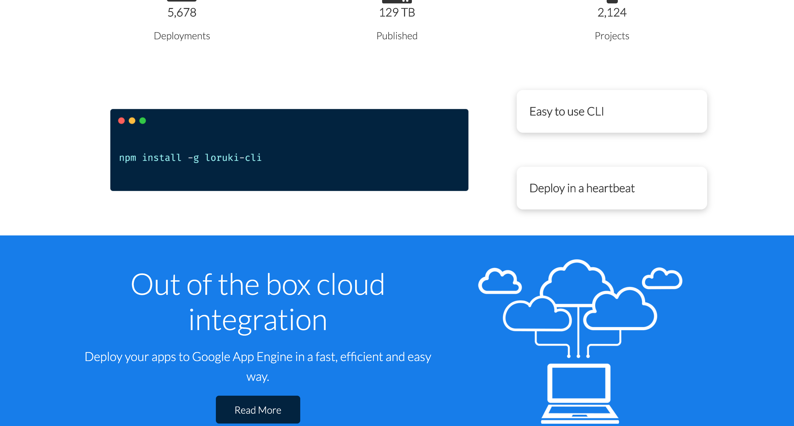
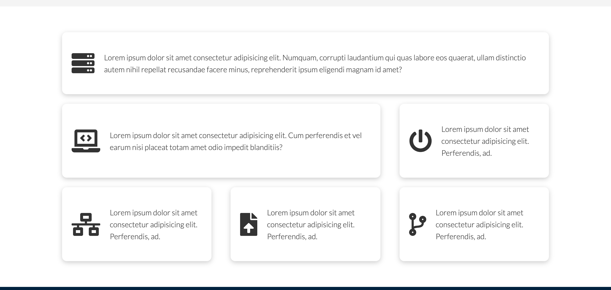
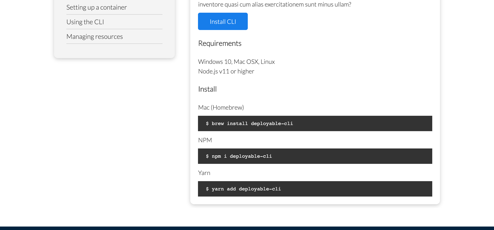

# Responsive Company Website
- This project was bootstrapped with [Create React App](https://github.com/facebook/create-react-app).
- This project design was inspired by [TraversyMedia](https://traversymedia.com/).

## General description
- Template company website.
- React.Js app. 
- Vanilla css3.

### `yarn start`
- Runs the app in the development mode.\
- Open [http://localhost:3000](http://localhost:3000) to view it in the browser.

## App screenshots
<h1 align="center">
    
    
    
    
    
    
    
    
    
    
    
    
</h1>

## Roadmap
- Responsive design for features and docs page.
- Adding animations.
- Connecting contact form to email service.
- Deploy the website to he web.